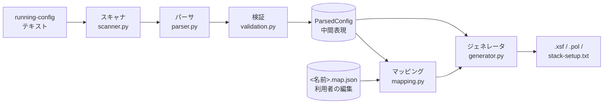
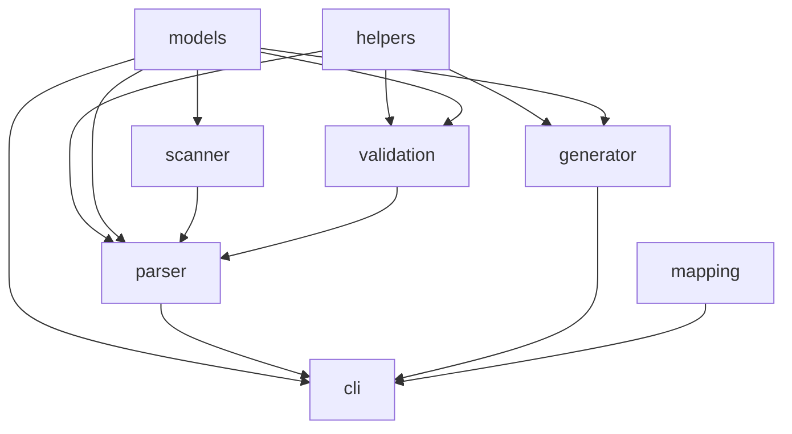

# コード / アーキテクチャ解説

このドキュメントは「内部で何が起きているか」を把握するためのものです。
実装の細部よりも、データがどう流れ、どこで何が決まるかに重点を置いています。

## 1. 全体像

入力は Cisco スイッチの設定テキスト、出力は EXOS の設定スクリプト (`.xsf`) と
ポリシーファイル (`.pol`) です。処理は 5 つの段階を一方向に流れます。



各段階は前の段階の出力だけを受け取ります。このため「どこで壊れたか」を段階ごとに切り分けられます。

## 2. ファイル構成

```
main.py                         コマンドライン入口 (cli.py を呼ぶだけ)
cisco_exos_translator/
  __init__.py                   公開 API のまとめ
  cli.py                        引数処理、ファイルの読み書き、マッピングの往復
  scanner.py                    テキスト -> ブロック
  parser.py                     ブロック -> 中間表現 (後処理・検証の呼び出しを含む)
  models.py                     中間表現のデータクラス
  validation.py                 相互参照チェック (警告を返す)
  mapping.py                    .map.json の読み書きとマージ
  generator.py                  中間表現 + マッピング -> EXOS 出力
  helpers.py                    VLAN リスト、インターフェース名、アドレスの変換
tests/                          unittest によるテスト
docs/                           日本語ドキュメント (使い方、本書、ACL パターン、テスト文書)
docs_old/                       置き換え済みの旧ドキュメント (参照用)
```

依存関係は次のとおりで、循環はありません。`models.py` と `helpers.py` が土台、
`parser.py` と `generator.py` が中心、`cli.py` がそれらを束ねます。



## 3. 各段階の役割

### 3.1 スキャナ (`scanner.py`)

設定テキストを **行の集まり** から **ブロックの集まり** に変える段階です。まだ意味の解釈はしません。

1. 空行と `!` で始まる行 (区切り・コメント) を捨てる
2. 残った行に元の行番号とインデント幅を付ける
3. インデント 0 の行のうち `vlan <IDリスト>`、`interface ...`、`interface range ...`、
   `ip access-list standard|extended <名前>` を「ブロックの見出し」とみなし、
   続くインデント付きの行を本文として束ねる
4. それ以外の行は「global」ブロックにまとめる

`vlan internal allocation policy ...` のような VLAN 定義ではない `vlan` コマンドは、
見出しの判定を ID リストの形に限定しているため global 行として扱われます。

なぜこの段階を分けるのか: Cisco の設定はインデントで階層を表すだけで、明示的な終端記号がありません。
「どこからどこまでが 1 つのインターフェースの設定か」を先に確定させておくと、
後段のパーサは 1 ブロックずつ独立に処理でき、単純になります。

### 3.2 パーサ (`parser.py`)

ブロックを 1 つずつ受け取り、種類に応じて中間表現を組み立てます。

| ブロック種類 | 処理 |
|---|---|
| global | `hostname`、`switch N provision / priority`、`ip route`、番号付き `access-list`、`monitor session` を読む。`ip routing` と `end` は消費するだけ。他は「未対応行」へ |
| vlan | 見出しの `10,20,30-32` のような ID 指定を展開し、`name` を全 VLAN に付ける |
| acl | 各行 (ACE) を 1 つずつ解釈。対応範囲外のトークンが 1 つでもあれば行ごと「未対応行」へ (部分変換はしない) |
| interface / interface range | 見出しの名前 (範囲) を個々の正規化名に展開し、本文の各行を各インターフェースに適用 |

インターフェース本文は 1 行ずつ正規表現で照合し、最初に一致した規則を適用します。
どの規則にも一致しない行は、そのインターフェースの「未対応行」に行番号付きで残します。

重要な判断:

- **名前は最初に正規化する。** `Gi1/0/1` も `GigabitEthernet1/0/1` も同じキーになります。
  同じポートが設定内に 2 回現れても 1 つのオブジェクトに統合されます。
- **物理ポートと Port-channel は別のクラス。** 物理ポートは名前から
  スタックメンバー / モジュール / ポート番号を分解して持ち、後段の EXOS ポート番号の元になります。
- **`no switchport` と `ip address` は `mode = "routed"` にする。** L3 ポートは変換対象外ですが
  存在自体は記録し、警告にします。SVI (`interface VlanN`) の IP アドレスだけは L3 変換に使います。
- **SPAN の行はセッション番号ごとに蓄積する。** Cisco では 1 セッションの設定が複数行に
  分かれているため、同じ番号の行を 1 つのオブジェクトにまとめます。
  ソース / 宛先に出てきたポートはインターフェースとしても登録し、ポート番号の対応表に載るようにします。

ブロックをすべて処理した後、2 つの後処理を行います。

1. **Port-channel の結合**: `channel-group N` を持つ物理ポートを `Port-channelN` のメンバーに追加します。
   `interface Port-channelN` ブロックがなくても、メンバーがあれば作られます。
   メンバーは自然順 (`Gi1/0/9` → `Gi1/0/10`) に並べ、先頭が既定のマスターポートになります。
2. **スタックメンバーの推定**: ポート名に現れたスタック番号 (`Gi2/0/1` の 2) から
   メンバーの存在を補います。

最後に検証 (3.3) を呼び、その警告を中間表現に載せて返します。
この一連の流れの入口が `parse_cisco_config()` です。

### 3.3 検証 (`validation.py`)

組み立て終わった中間表現を横断的にチェックし、**警告文字列のリスト** を返します。
例外は投げません。設定の矛盾は珍しくないため、処理を止めずに一覧で示す方針です。

チェック項目:

- アクセス VLAN / トランク許可 VLAN / ネイティブ VLAN が `vlan` ブロックで定義されているか
- access モードなのにトランク設定がある、または trunk モードなのにアクセス VLAN がある
- ルーテッドポート (対象外であることを知らせる)。IP アドレス付きの SVI は除く
- Port-channel にメンバーがいない
- SPAN セッションにソースと宛先が揃っているか、同じポートが両方になっていないか、
  ソース VLAN やフィルタ ACL が定義されているか
- 変換できなかった ACE を含む ACL (不完全な ACL として 1 回だけ警告)

インターフェースは自然順に並べてからチェックするので、警告の順序は毎回同じです。

### 3.4 マッピング (`mapping.py`)

変換上の「判断」を利用者が上書きできるようにする仕組みです。

- ジェネレータが中間表現から **既定値** (VLAN 名、ポート番号、LAG のマスターとモード、ミラー名、
  egress モード) を導き、初回実行時に `<名前>.map.json` として書き出します。
- 2 回目以降は、既定値の上に利用者の編集内容を **重ねます** (`merge_mapping`)。
  利用者の値が勝ち、ファイルにない項目は既定値で補い、Cisco 設定に存在しない項目は無視します。
  補った・無視した項目はそれぞれ警告として `.xsf` に載ります。
- 既定値は毎回計算し直すため、Cisco 設定が変わってもマッピングファイルを作り直す必要はありません。

### 3.5 ジェネレータ (`generator.py`)

中間表現とマッピングから EXOS の出力を組み立てます。次の順で決めていきます。

1. **VLAN 名の確定**: 定義済み VLAN と、ポートや SVI、SPAN から参照されている VLAN の
   和集合に名前を割り当てます。タグ 1 は `Default`。名前は EXOS の規則に整形し、重複はタグで区別します。
2. **ポート番号の確定**: マッピングの `ports` を採用し、`uplinks.start` があればプレースホルダを解決します。
   残ったプレースホルダ、名前のままのポート、番号の重複を警告します。
3. **LAG の確定**: マスターポート (マッピングが優先)、メンバー、LACP / 静的を決めます。
4. **ミラー計画**: SPAN セッションごとにミラーインスタンスの行を組み立てます。
   宛先ポートは通常のポート設定から除外する必要があるため、ポート設定より **先に** 計画します。
5. **本体の出力**: System → Stacking → VLANs → Link aggregation → Port configuration → L3 → ACLs →
   Mirroring の順に行を並べます。
6. **ACL ポリシーの生成**: 適用先のある ACL ごとに `.pol` の内容を作ります。
   FSPAN のフィルタは `mirror` アクション付きの別形式で作ります。
7. **先頭への付加**: 変換対応表 (Translation reference) と WARNINGS を `#` コメントとして先頭に付けます。

出力順序には理由があります。VLAN はポートを所属させる前に存在している必要があり、
`enable sharing` は VLAN 所属より前でないと EXOS が拒否し、モニターポートの `Default` からの削除と
フィルタ ACL の適用は `enable mirror` より前でないと実機で対話プロンプトやエラーになります
(詳細は [hardware-testing.md](hardware-testing.md) を参照)。

スタック構成の場合は、別関数 `generate_stack_setup()` がスタック構築手順書を生成します。
これは `.xsf` に含めません。スタック化は再起動を伴い、設定コンテキストも新しくなるためです。

### 3.6 CLI (`cli.py`)

`main.py` から呼ばれる薄い層です。入力ファイルをすべて読み込んで解析してから、
1 ファイルずつマッピングの読み書き、`.xsf` / `.pol` / 手順書の書き出しを行います。
ロジックは持たず、上記の関数を順に呼ぶだけです。

## 4. 中間表現 (IR) のデータ構造

すべて `models.py` の `dataclass` です。

```
ParsedConfig
├─ hostname: str | None
├─ vlans: {vlan_id: Vlan}
│    └─ name, source_lines
├─ acls: {ACL名 (番号は文字列): [AclRule]}
│    └─ action (permit/deny/remark), protocol, source, destination,
│       source_port, destination_port, remark, line_number
├─ static_routes: [(宛先 CIDR, ネクストホップ)]
├─ interfaces: {正規化名: PhysicalInterface | PortChannelInterface}
│    ├─ 共通 (BaseInterface):
│    │    name (元表記), canonical_name, interface_type
│    │    description, mode ("access" | "trunk" | "routed" | None), shutdown
│    │    access_vlan, trunk_allowed_vlans (set), trunk_native_vlan
│    │    access_group_in, ip_address (CIDR、SVI 用)
│    │    source_lines, unsupported_lines: [UnsupportedLine]
│    ├─ PhysicalInterface: stack_member, module, port, channel_group, channel_mode
│    └─ PortChannelInterface: id, members: [正規化名]
├─ monitor_sessions: {セッション番号: MonitorSession}
│    └─ source_ports [(名前, 方向)], source_vlans [(ID, 方向)],
│       destination_ports, filter_acl, encapsulation_replicate, source_lines
├─ stack_members: {member_id: StackMember}
│    └─ provision_model, priority
├─ unsupported_lines: [UnsupportedLine]   ← グローバル行と ACL 行
│    └─ line_number, context, text, reason
└─ warnings: [str]                        ← パーサと検証の警告
```

`port_channels` は `interfaces` から Port-channel だけを ID 順に取り出すプロパティです。

設計上の約束:

- **元の行番号を必ず持つ。** `source_lines` と `UnsupportedLine.line_number` により、
  中間表現のどの値も設定ファイルのどの行から来たか追跡できます。
- **捨てない。** 解釈できない行は必ずどこかの `unsupported_lines` に残り、
  `.xsf` の「Not translated」に集計されます。
- **Cisco の意味をそのまま持つ。** EXOS の概念 (untagged / tagged、sharing など) は
  ここには持ち込みません。変換規則はジェネレータに閉じ込めます。
- **順序が決まっている。** 辞書のキー順、メンバー順、警告順はすべて決定的なので、
  同じ入力からは常に同じ出力が得られ、差分比較ができます。
- **判断はマッピングに外出しする。** 「どう変換するか」で利用者が変えたくなるものは
  すべてマッピングファイルに載せ、コードを触らずに調整できるようにします。

## 5. 拡張のしかた

新しい Cisco コマンドに対応する典型的な手順:

1. 必要なら `models.py` のデータクラスにフィールドを追加する
2. `parser.py` に正規表現 `RE_...` を追加し、`_apply_interface_line` (または該当ブロック関数) に分岐を追加する
3. 相互参照チェックが必要なら `validation.py` に追加する
4. `generator.py` の該当セクションに出力行を追加する。利用者が変えたくなる判断なら
   `build_default_mapping` と `mapping.py` の `_SECTIONS` にも項目を足す
5. `tests/` の該当ファイルに最小スニペットのテストを追加する
6. `docs/usage.md` の対応表を更新する

新しいインターフェース種別を追加する場合は `helpers.py` の `INTERFACE_TYPE_NAMES` と
`INTERFACE_ABBREV_MAP` に 1 行ずつ足すだけです。省略形は長いものを先に並べてください
(例: `Twe` を `Tw` より前に)。
